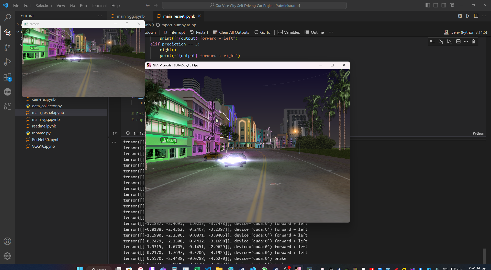

# **GTA Self Driving Car using Convulotional Neural Network with Pytorch**
 Assuming you have pytorch installed in your PC and has GPU atleast 8gb of Vram then your good and use it as Acceleration for training this is optional but can perform faster(exponentially) than training with cpu.

How to use:  1. Download and Install Gta Vice City from Steam or any store that sells GTA VC as it was removed from steam since the release of GTA Trilogy Definitive Edition   2. Prepare the Data [Raw Datset](https://www.kaggle.com/datasets/rjrendonrj/gta-vice-city-self-driving-car-raw-dataset) and [Resized Dataset](https://www.kaggle.com/datasets/rjrendonrj/gta-vice-city-self-driving-car-resized-dataset) or collect using the datacollector.py. I personally did not use it because of a delay when doing a screenshot for every input/move I make thats why I use Steam built in screenshot for fast capture and accurate data.  3. Set up OBS with a virtual camera and load the Gta Vice City Windows in the camera (Optional).   4. Train the model with the dataset with in those notebook, I named it as [ResNet50](https://arxiv.org/pdf/1512.03385.pdf) and [VGG16](https://arxiv.org/pdf/1409.1556.pdf) base in their architecture will add soon if I have time :) More details on how the model recieve the data in Notebook comments.   5. Test the trained model on their main files Ex.: Resnet50 -> main_resnet50 Notebook and so on.   6. Have fun and enjoy the game and your trained model.

Vide Demo: [Video](https://drive.google.com/file/d/1wg1Fhn8sxOJMqGeYTyo_8Vtgg2Vd7Jh-/view?usp=drive_link)

## My Training Details:
**ResNet50: [HuggingFace Link](https://huggingface.co/rj1323/GTA-Vice_City_Autonomous_ResNet-50_Model)**  1. **Training Data** was Shuffled to make the training generalize the data and lose some linearity.  2. **Test or Validation Data** is not Shuffled to maintain its purity.  3. **Batch size is 256** this is the max my gpu can get, >256 will result cuda error(not enough vram).   4. **Load the pretrained ResNet50 model** or its best weights.  5. **Modify the Last layer(output) in to 4** for the brake, forward, left, right (alphabetical structure).   5. **Using the CrossEntropy as the Loss Function**.   6. Using **Adam** as the optimizer with the **learning rate** of **0.001**.   7. Trained the model for **50 epochs** and got **95.49% accuracy** with **Loss of 0.2373**.   8. Save the trained model.

**VGG16: [HuggingaFace Link](https://huggingface.co/rj1323/GTA-Vice_City_Autonomous_VGG16_Model)**  1. Same as ResNet50.  2. Same as ResNet50.  3. **Batch size is 96** this is the max my gpu can get, >96 will result cuda error(not enough vram).   4. **Load the pretrained VGG16 model** or its best weights.  5. **Modify the Last layer(output) in to 4** for the brake, forward, left, right (alphabetical structure).   5. **Using the CrossEntropy as the Loss Function**.   6. Using **Adam** as the optimizer with the **learning rate** of **0.001**.   7. Trained the model for **25 epochs** and got **84.39% accuracy** with **Loss of 0.4402**.   8. Save the trained model. 